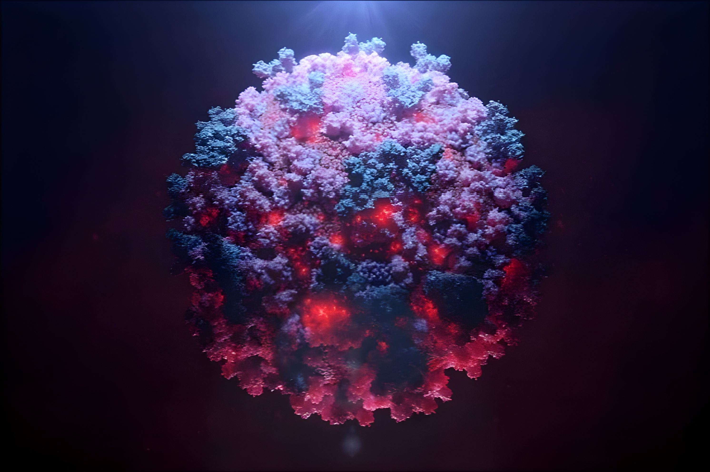

# Línea de tiempo - Transmisibilidad del Sars-Cov2
Desde el inicio de la pandemia de COVID-19 en 2019, el virus SARS-CoV-2 ha acumulado mutaciones que han dado lugar a múltiples variantes con distintos grados de transmisibilidad y evasión inmunológica. Entre los genes virales, el gen S, que codifica la proteína Spike, ha sido uno de los más estudiados, ya que permite la entrada del virus a las células humanas a través del receptor ACE2.
El seguimiento de las mutaciones en el gen S permite identificar qué cambios pueden afectar la eficacia de las vacunas actuales, así como anticipar la aparición de variantes con potencial de generar nuevas olas epidémicas. Por ello, es crucial monitorear continuamente su evolución genética y funcional.

Nuestro objetivo como investigadores, es establecer una línea de tiempo sobre **qué es exactamente lo que ha hecho al virus tan infeccioso**, enfocándonos en las mutaciones del gen en cuestión.

## Marco teórico
Diversos estudios han demostrado que el SARS-CoV-2 comparte más del 96% de su genoma con coronavirus de murciélagos, y que su linaje probablemente se separó de su ancestro más cercano RaTG13 hace entre 40 y 70 años. Esta historia evolutiva sugiere que existen múltiples linajes zoonóticos (grupo específico dentro de un linaje evolutivo en animales con la capacidad de causar infecciones en humanos o viceversa) aún no muestreados, con potencial de emerger en humanos.
La proteína Spike es una glicoproteína de membrana dividida en dos subunidades: S1, que contiene el dominio de unión al receptor (RBD), y S2, responsable de la fusión de la membrana viral con la célula hospedadora. Las mutaciones en S1, especialmente en el RBD, son de particular interés, ya que pueden aumentar la afinidad por ACE2 o permitir escape inmune.
A lo largo de la pandemia, variantes como Delta y Ómicron han acumulado múltiples mutaciones no sinónimas en esta región, lo que se ha traducido en una mayor capacidad de transmisión, así como una reducción en la neutralización por anticuerpos generados por infecciones previas o vacunas. La vigilancia de estas mutaciones proporciona un panorama sobre la adaptabilidad del virus y su potencial pandémico.

## Hipótesis
Se espera encontrar que las variantes más recientes, como las subvariantes de Ómicron, presentan un mayor número de mutaciones no sinónimas en el gen S, especialmente en regiones críticas como el dominio RBD, en comparación con variantes anteriores como Alfa o Beta. Estas mutaciones probablemente están asociadas con una mayor capacidad de transmisión y una mayor evasión de la respuesta inmune, lo que explicaría su predominio en las olas más recientes de contagio.


```{r setup, include=FALSE}
# Working directory and dependencies
setwd("/home/gero/Documents/projects/tec/biologia/project/src")

# Cargar librerías
library(seqinr)
library(dplyr)
library(ggplot2)
library(Biostrings)
library(pwalign)
library(foreach)
library(doFuture)
library(future)

plan(multisession)  
registerDoFuture()
# handlers(global = TRUE)

# Archivos
ref_file <- "../data/wuhan.fasta"
variant_files <- c(
                   "../data/alpha.fasta",
                   "../data/beta.fasta",
                   "../data/gamma.fasta",
                   "../data/delta.fasta",
                   "../data/omicronba1.fasta",
                   "../data/omicronba2.fasta",
                   "../data/omicronjn1.fasta"
)

#  Función para extraer glicoproteína de superficie
# extract_surface_glycoproteins <- function(filepath) {
#     fasta_seqs <- read.fasta(filepath, seqtype = "DNA", as.string = TRUE, whole.header = TRUE, forceDNAtolower = FALSE)
#     headers <- names(fasta_seqs)
#     is_surface <- grepl("\\|surface glycoprotein", headers)
#     if (sum(is_surface) == 0) stop("No se ha encontrado ningún gen S en el archivo fasta.")
#     surface_seqs <- fasta_seqs[is_surface]
#     sequences <- unlist(surface_seqs)
#     names(sequences) <- headers[is_surface]
#     return(sequences)
# }

extract_surface_glycoproteins <- function(filepath, max_seqs = 1000) {
    # Leer archivo FASTA
    fasta_seqs <- read.fasta(filepath, seqtype = "DNA", as.string = TRUE, whole.header = TRUE, forceDNAtolower = FALSE)
    headers <- names(fasta_seqs)

    # Encontrar secuencias que contengan "surface glycoprotein" en el encabezado
    is_surface <- grepl("\\|surface glycoprotein", headers)

    if (sum(is_surface) == 0) {
        stop("No surface glycoprotein genes found in the file")
    }

    # Extraer secuencias de glicoproteína de superficie
    surface_seqs <- fasta_seqs[is_surface]

    # Limitar a las primeras max_seqs secuencias
    if (length(surface_seqs) > max_seqs) {
        surface_seqs <- surface_seqs[1:max_seqs]
        cat(sprintf("Limited to first %d sequences from %s\n", max_seqs, basename(filepath)))
    }

    sequences <- unlist(surface_seqs)
    names(sequences) <- names(surface_seqs)
    return(sequences)
}


#  Función de alineamiento con limpieza previa
needleman_wunsch <- function(ref_seq, var_seq) {
    dna_mat <- nucleotideSubstitutionMatrix(
                                            match = 2,
                                            mismatch = -4
    )
    alignment <- pairwiseAlignment(
                                   pattern = var_seq,
                                   subject = ref_seq,
                                   substitutionMatrix = dna_mat,
                                   gapOpening = -8,
                                   gapExtension = -1,
                                   type = "global"
    )
    aln_ref <- as.character(subject(alignment))
    aln_var <- as.character(pattern(alignment))
    return(c(aln_ref, aln_var))
}

#  Inicializar tabla de mutaciones
mutations <- data.frame(
                        codon_position = integer(),
                        ref_codon = character(),
                        var_codon = character(),
                        ref_aa = character(),
                        var_aa = character(),
                        aa_change = character(),
                        type = character(),
                        variant = character(),
                        stringsAsFactors = FALSE
)

#  Comparar una secuencia de variante contra la referencia
compare_sequences <- function(ref_seq, var_seq, variant_name) {
    mutations_local <- data.frame(
        codon_position = integer(),
        ref_codon = character(),
        var_codon = character(),
        ref_aa = character(),
        var_aa = character(),
        aa_change = character(),
        type = character(),
        variant = character(),
        stringsAsFactors = FALSE
    )

    if (nchar(ref_seq) != nchar(var_seq)) {
        aligned <- needleman_wunsch(ref_seq, var_seq)
        aln_ref <- aligned[1]
        aln_var <- aligned[2]
    } else {
        aln_ref <- ref_seq
        aln_var <- var_seq
    }

    len <- min(nchar(aln_ref), nchar(aln_var))
    len <- len - (len %% 3)

    for (i in seq(1, len, by = 3)) {
        ref_codon <- substr(aln_ref, i, i+2)
        var_codon <- substr(aln_var, i, i+2)
        if (grepl("N", var_codon) || grepl("-", ref_codon) || grepl("-", var_codon)) next

        ref_aa <- seqinr::translate(s2c(ref_codon))
        var_aa <- seqinr::translate(s2c(var_codon))
        aa_change <- paste0(ref_aa, ceiling(i/3), var_aa)

        if (ref_codon != var_codon) {
            mut_type <- ifelse(ref_aa == var_aa, "synonymous", "non-synonymous")
            mutations_local <- rbind(mutations_local, data.frame(
                codon_position = i/3,
                ref_codon = ref_codon,
                var_codon = var_codon,
                ref_aa = ref_aa,
                var_aa = var_aa,
                aa_change = aa_change,
                type = mut_type,
                variant = variant_name,
                stringsAsFactors = FALSE
            ))
        }
    }

    return(mutations_local)
}

#  Cargar secuencia de referencia
ref_s_seq <- extract_surface_glycoproteins(ref_file)
ref_seq <- ref_s_seq[[1]]

#  Procesar variantes

mutation_results <- foreach(file = variant_files, .combine = rbind) %do% {
    variant_name <- gsub(".fasta", "", basename(file))
    var_seqs <- extract_surface_glycoproteins(file)

    foreach(i = seq_along(var_seqs), .combine = rbind) %dofuture% {
        var_seq <- var_seqs[[i]]
        compare_sequences(ref_seq, var_seq, variant_name)
    }
}

mutations <- mutation_results

```

## Wuhan - La mutación que desencadenó una pandemia
El virus Sars-Cov2 se originó a partir de su variante antecesora llamada RaTG13. El cambio clave que generó una gran afinidad al receptor humano ACE2, fue causado por un mecanismo llamado recombinación, que causó dos sustituciones clave: **S427N** y **F436Y**.





## Alpha - 40%-90% más transmisible

```{r}
key_mutations <- c("N501Y", "P681H", "D614G")

alpha_freqs <- mutations %>%
  filter(variant == "alpha", aa_change %in% key_mutations) %>%
  count(aa_change, name = "frequency")


ggplot(alpha_freqs, aes(x = aa_change, y = frequency, fill = aa_change)) +
  geom_bar(stat = "identity", color = "black") +
  labs(
    title = "Mutaciones clave en la variante Alpha",
    x = "Mutación",
    y = "Frecuencia"
  ) +
  theme_minimal() +
  scale_fill_brewer(palette = "Set2") +
  theme(legend.position = "none")
```

* N501Y
La mutación N501Y redujo el valor de afinidad (K<sub>D</sub>) de aproximadamente unos 80 nanomoles (nM) a ~8 nM, lo que significa que el virus se pega al receptor más fuerte y con más facilidad. 

* P681H
La mutación P681H ocurrió justo al lado del sitio de corte por furina (en la unión S1/S2 de la espícula), facilitando que la proteína Spike sea procesada más eficientemente por enzimas celulares, lo que acelera la entrada del virus en la célula.

* D614G
La mutación D614G no está en el dominio de unión al receptor, pero estabiliza la forma abierta de la proteína Spike, lo que permite una mayor proporción de espículas funcionales y, por tanto, una producción viral más alta y mayor capacidad de infección.


## Beta - 20% - 30% más transmisible que Alpha

```{r}
key_mutations <- c("E484K", "K417N", "N501Y", "P681H", "D614G")

alpha_freqs <- mutations %>%
  filter(variant == "beta", aa_change %in% key_mutations) %>%
  count(aa_change, name = "frequency")


ggplot(alpha_freqs, aes(x = aa_change, y = frequency, fill = aa_change)) +
  geom_bar(stat = "identity", color = "black") +
  labs(
    title = "Mutaciones clave en la variante Beta",
    x = "Mutación",
    y = "Frecuencia"
    ) +
  theme_minimal() +
  scale_fill_brewer(palette = "Set2") +
  theme(legend.position = "none")
```

* Tiene las mismas relevantes de Alpha

* E484K
Esta mutación reduce significativamente la actividad neutralizante de anticuerpos —ya sea de personas infectadas o vacunadas— hasta en un factor de 3 a >10 , sin necesariamente mejorar la afinidad por ACE2, pero sí facilitando la evasión inmune.

* K417N Lisina -> Asparagina
Afecta un residuo dentro del RBD que modula la unión a ACE2 y reduce la eficacia de ciertos anticuerpos monoclonales (clase 1), colaborando con un aumento global de afinidad al receptor cuando se combina con N501Y y E484K (disminución global de nM)


##  Gamma -- 30% - 40% más transmisible que Alpha


```{r}
key_mutations <- c("E484K", "K417T", "N501Y", "P681H", "D614G")

alpha_freqs <- mutations %>%
  filter(variant == "gamma", aa_change %in% key_mutations) %>%
  count(aa_change, name = "frequency")


ggplot(alpha_freqs, aes(x = aa_change, y = frequency, fill = aa_change)) +
  geom_bar(stat = "identity", color = "black") +
  labs(
    title = "Mutaciones clave en la variante Gamma",
    x = "Mutación",
    y = "Frecuencia"
  ) +
  theme_minimal() +
  scale_fill_brewer(palette = "Set2") +
  theme(legend.position = "none")
```

* Mismas mutaciones que Beta

* K417T Lisina -> Treonina
Aunque por sí sola esta mutación podría disminuir ligeramente la unión a ACE2, en combinación con N501Y y E484K aumenta la unión al receptor y añade una barrera adicional frente a anticuerpos monoclonales


##  Delta -- 50% - 60% más transmisible que Alpha


```{r}
key_mutations <- c("L452R", "T478K", "P681R", "D950N", "N501Y", "P681H", "D614G")

alpha_freqs <- mutations %>%
  filter(variant == "delta", aa_change %in% key_mutations) %>%
  count(aa_change, name = "frequency")


ggplot(alpha_freqs, aes(x = aa_change, y = frequency, fill = aa_change)) +
  geom_bar(stat = "identity", color = "black") +
  labs(
    title = "Mutaciones clave en la variante Delta",
    x = "Mutación",
    y = "Frecuencia"
  ) +
  theme_minimal() +
  scale_fill_brewer(palette = "Set2") +
  theme(legend.position = "none")
```

* Mismas mutaciones que Alpha

* L452R
Aumenta la afinidad al receptor (disminución de nM)

* T478K
Aumenta ligeramente la afinidad al receptor y promueve la evasión inmune

* P681R
Aumenta la afinidad en la secuencia que es cortada por la enzima humana llamada furina, lo cual hace que la entrada del virus sea mucho más eficiente, como un flash pass. 


## Ómicron BA.1 -- El doble o triple que Delta


```{r}
key_mutations <-  c(
  "A67V", "T95I", "G142D", "L212I",
  "G339D", "S371L", "S373P", "S375F", "K417N", "N440K", "G446S", "S477N", "T478K",
  "E484A", "Q493R", "G496S", "Q498R", "N501Y", "Y505H",
  "T547K", "D614G", "H655Y", "N679K", "P681H",
  "N764K", "D796Y", "N856K", "Q954H", "N969K", "L981F"
)

alpha_freqs <- mutations %>%
  filter(variant == "omicronba2", aa_change %in% key_mutations) %>%
  count(aa_change, name = "frequency")


ggplot(alpha_freqs, aes(x = aa_change, y = frequency, fill = aa_change)) +
  geom_bar(stat = "identity", color = "black") +
  labs(
    title = "Mutaciones clave en la variante Ómicron BA.1",
    x = "Mutación",
    y = "Frecuencia"
  ) +
  theme_minimal() +
  scale_fill_brewer(palette = "Set2") +
  theme(
    legend.position = "none",
    axis.text.x = element_text(angle = 45, hjust = 1, vjust = 1)  # Rotate 45°, adjust alignment
  )
```

* Mutaciones RBD (incremento en afinidad)
    * G339D
    * S371L
    * S373P
    * S375F
    * K417N
    * N440K
    * G446S
    * S477N
    * T478K
    * E484A
    * Q493R
    * G496S
    * Q498R
    * N501Y
    * Y505H

* Mutaciones en el sitio de corte de furina (reconocimiento)
    * H655Y
    * N469K
    * P681H

* Mutaciones en la región de fusión (estabilidad de la proteina Spike)
  La proteína Spike está formada por tres subunidades que deben de mantenerse juntas, correctamente plegadas y funcionales para concluir exitosamente el proceso de infección
    * T547K
    * D614G
    * N764K
    * D796Y
    * N856K
    * Q954H
    * N969K
    * L981F

* NOTA: La variante Ómicron tiene importantes deleciones en 3 posiciones distintas, las cuales desfavorecen al algoritmo de needleman-wunsch para alinear las secuencias, aún después de modificar los parámetros de penalización y acierto, por lo cual muchas mutaciones relevantes, como la N501Y, no están presentes en la gráfica.

* Datos curiosos:
    * Se sospecha que las numerosas mutaciones de Ómicron tuvieron lugar en un solo hospedador inmunocomprometido (por ejemplo, un paciente con VIH). Dichos pacientes pueden actuar como una incubadora, ya que al tener un sistema inmune deficiente, el virus puede reproducirse masivamente y durante periodos prolongados.
    * Es posible que la variante haya estado en algún punto dentro de un ratón, ya que hay dos mutaciones específicas que aumentarían la afinidad ampliamente en ratones, además de no haber un beneficio claro de dichas mutaciones en la transmisibilidad en humanos. Las mutaciones en cuestión son Q493R y Q498R.


## Ómicron BA.2 - 30% más que BA.1


```{r}
key_mutations <-  c(
  "A67V", "T95I", "G142D", "G339D", "S371F", "S373P", "S375F", 
  "K417N", "N440K", "S477N", "T478K", "E484A", "Q493R", 
  "Q498R", "N501Y", "Y505H", "D614G", "H655Y", "N679K", 
  "P681H", "N764K", "D796Y", "Q954H", "N969K", "L981F",
  
  "T19I", "L24S", "V213G", "T376A", "D405N", "R408S", "S704L"
)

alpha_freqs <- mutations %>%
  filter(variant == "omicronba2", aa_change %in% key_mutations) %>%
  count(aa_change, name = "frequency")


ggplot(alpha_freqs, aes(x = aa_change, y = frequency, fill = aa_change)) +
  geom_bar(stat = "identity", color = "black") +
  labs(
    title = "Mutaciones clave en la variante Ómicron BA.2",
    x = "Mutación",
    y = "Frecuencia"
  ) +
  theme_minimal() +
  scale_fill_brewer(palette = "Set2") +
  theme(
    legend.position = "none",
    axis.text.x = element_text(angle = 45, hjust = 1, vjust = 1)  # Rotate 45°, adjust alignment
  )
```

* **RBD (afinidad/escape inmune)**:  
  `G339D, S371F, K417N, T376A, D405N, R408S, N501Y`  
  *Diferencias con BA.1*: Pierde `G446S/G496S`, gana `T376A/D405N/R408S`.  

* **Furina (sitio de corte)**:  
  `H655Y, P681H, N679K, S704L` *(S704L es nueva en BA.2)*  

* **Fusión/Estabilidad**:  
  `T19I, L24S, D614G, L981F` *(T19I/L24S exclusivas de BA.2)*  

* **Deleciones**: BA.2 **NO** tiene `Δ69-70/Δ143-145/Δ211` (que sí tenía BA.1).  

* **Dato clave**: BA.2 fue un 30% más transmisible que BA.1, pero menos resistente a anticuerpos.  


## Ómicron JN.1

```{r}
key_mutations <- c(
  "V213E",  
  "R493Q",  
  "D574V",  
  "F486P",  
  "R346T", 
  "L455S",  
  "F456L", 
  "G339H",
  "N460K",
    "K417N", "N440K", "S477N", "T478K", "E484A", "Q493R"

)

alpha_freqs <- mutations %>%
  filter(variant == "omicronjn1", aa_change %in% key_mutations) %>%
  count(aa_change, name = "frequency")


ggplot(alpha_freqs, aes(x = aa_change, y = frequency, fill = aa_change)) +
  geom_bar(stat = "identity", color = "black") +
  labs(
    title = "Mutaciones clave en la variante Ómicron JN.1",
    x = "Mutación",
    y = "Frecuencia"
  ) +
  theme_minimal() +
  scale_fill_brewer(palette = "Set2") +
  theme(
    legend.position = "none",
    axis.text.x = element_text(angle = 45, hjust = 1, vjust = 1)  
  )
```

**Origen**: Descendiente directo de XBB (no es recombinante).  

#### **Mutaciones clave vs. XBB**:  
- **Conservadas de XBB**:  
  `F486P`, `R346T`.  
- **Nuevas en JN.1**:  
  `L455S` (+20% transmisibilidad), `F456L` (sinergia), `G339H` (escape inmune).  

### **Datos Curiosos**  
1. **XBB fue el primer recombinante global**: Apareció en **2022** y obligó a actualizar vacunas. Mezcla de BA.2.10.1 y BA.2.75
2. **JN.1 tuvo una ventaja oculta**: La mutación `L455S` era **invisible** a tests PCR comunes.  
3. **BA.2.75 (uno de los "padres" de XBB)**: Fue apodado **"Centaurus"** por su rápida expansión en India.  
4. **XBB.1.5**: Subvariante de XBB con **F486P mejorada**, dominó EE.UU. en 2023.  


# Variantes que utilizan receptores distintos a hACE2
Después de la investigación descubrimos que ninguna variante de Sars-CoV-2 utiliza un receptor distinto como receptor principal, sin embargo hay estudios que sugieren que algunas variantes, como Delta y Ómicron, han tenido mutaciones que permiten utilizar otros receptores, principalmente el receptor Neuropilina (NRP1). Las mutaciones específicas son: 
* Delta: P681R  ->  Corte de furina
* Ómicron BA.1  ->  La deleción Δ69-70 podría permitir infectar células incluso cuando ACE2 está bloqueado por anticuerpos.
